# 开始编写您的第一个机器人

在本文档中，您将学会如何使用Starbot编写您的第一个聊天机器人（以IIROSE蔷薇花园为例），本文档实现的逻辑为：“当机器人收到房间消息‘你好’时进行回复‘你好呀’”。

## 获取应用程序

可以从GitHub仓库获取本项目的源代码或分发的可执行文件

[Github仓库](https://github.com/TsubakiLoL/Godot-Robot)

本项目基于Godot 4.4版本开发

[Godot官网](https://godotengine.org/)

## 获取插件

 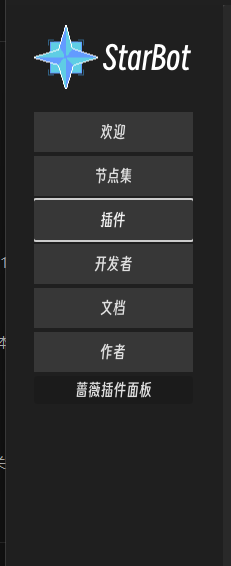

 打开插件侧边栏可以查看当前已经装载的插件

 请确认已经装载了如下插件(默认分发携带基础插件)

- 基础插件
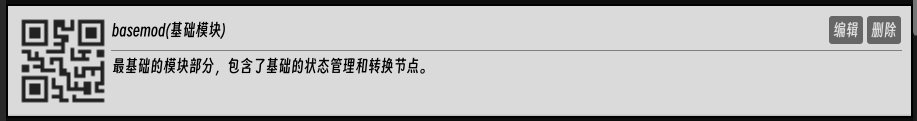
- 计算节点插件
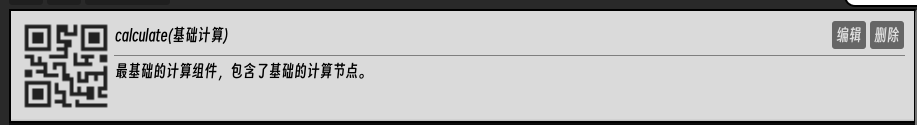
- 蔷薇花园API插件

  <strong style="color:rgb(255, 255, 255)">如果没有对应的插件可以尝试去侧边栏插件市场去搜索下载</strong>

## 开始编写可视化逻辑

拥有了以上插件依赖后，我们就可以为蔷薇花园编写一个基础的问答机器人逻辑了

  <strong style="color:rgb(255, 255, 255)">Starbot的可视化逻辑被保存成了一个文本文件，我们称之为“节点集”，文件的后缀名一般为.nodeset</strong>

### 创建节点集文件

打开侧边栏中的节点集栏，我们可以点击创建节点集来进行新的节点逻辑的创建，创建完毕后，我们应该可以看到如下的条目
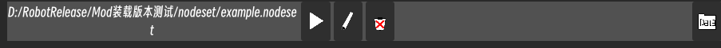

### 进行可视化编辑

点击其中的笔图标我们就可以对这个节点集逻辑进行编辑了，正常情况下你应该可以看到如下界面：

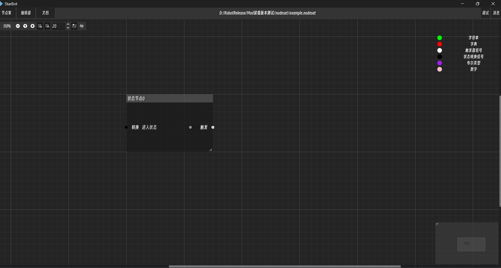

这是我们的可视化编辑器,其中的可浮动窗口我们称之为节点，这也是为什么可视化逻辑集合被称为节点集的原因。

  <strong style="color:rgb(255, 255, 255)">什么是节点？</strong> 
  节点是可视化逻辑的基本构成单元，可以进行处理结果的传递。 
  每个节点可视化UI左侧的端口名为输入端口，右侧的为输出端口，当左侧端口的所有端口都得到输入数据时，节点内部就会处理这些输入，然后把结果传递到输出端口中，并通过输出端口传递到与之相连的下游节点的输入端口中

  <strong style="color:rgb(255, 255, 255)">一些快捷键</strong> 
  
  ctrl+s:快速保存
   
  
  右键:创建新节点
   
  
  选中节点后delete键:删除此节点
  

现在我们可以看到这个名为状态节点的节点，一般情况下，这个状态节点作为我们机器人逻辑的入口，所有消息都会经过当前用户所在的状态节点进行处理

### 创建触发器节点
现在我们可以右键点击，创建一个新的节点-触发器节点

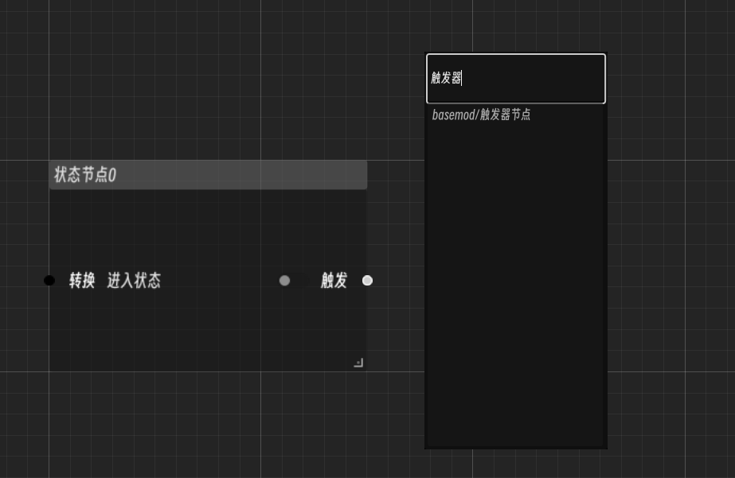

  <strong style="color:rgb(255, 255, 255)">什么是触发器节点？</strong> 
  
  触发器实际上是一个筛选特定消息类型的节点，他只筛选特定的消息类型使其通过，若状态节点传递的消息不是当前触发器所选消息类型，则阻止其到达下游节点，由此达到筛选消息类型的功能
  

这个示例逻辑采用的是蔷薇花园的房间消息，故我们把触发器筛选的消息类型改为-蔷薇房间

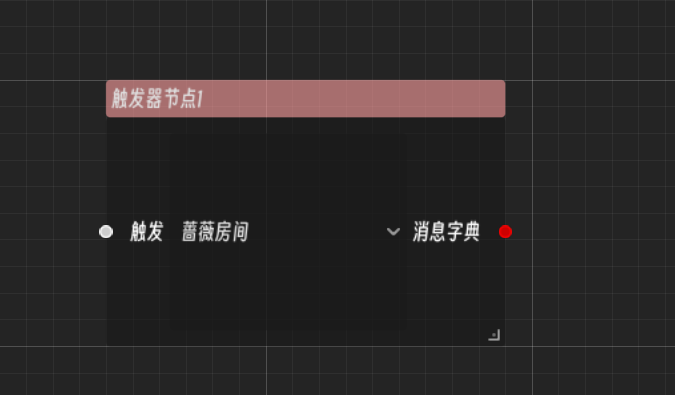

然后我们将状态节点与触发器节点进行连接

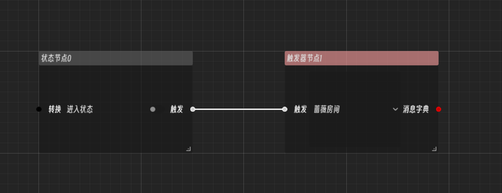

这样，我们就完成了消息类型的筛选，现在触发器下游就只能收到蔷薇花园内当前所在房间发送的消息了

### 提取消息内容

蔷薇花园插件提供了一个提取消息内容的节点-蔷薇消息内容提取器
我们可以看到，它的输入端口0为字典，输出端口1为字符串，
我们将其连接到触发器的输出端口上，然后选择其输出的内容，就可以提取出不同的消息内容了。我们将其设置为发信人消息内容。
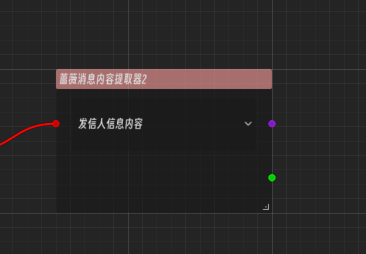

这样我们就完成了消息的内容提取。

### 编写响应式回复

既然我们已经提取了消息内容，下一步，就要判断消息内容为何了，为此，我们需要设置第二层过滤。

添加一个字符串判定器，然后向其中的输入框填入“你好”，并将其与蔷薇消息内容处理器连接起来，我们就完成了消息内容的判定

  <strong style="color:rgb(255, 255, 255)">什么是字符串判定器节点？</strong> 
  
  字符串判定器接受一个字符串输入，输出一个布尔类型值，当接受的输入和输入框输入的内容完全一致时，则向输出端口输出“真”，否则输出“假”。
  

既然已经完成了用户消息内容的判定，下一步我们就要进行回复内容的编写。
新建一个静态房间消息发送器（蔷薇花园），向其中输入回复“你好呀”，并将其连接到字符串判定器。

  <strong style="color:rgb(255, 255, 255)">什么静态房间信息发送器节点？</strong> 
  
 静态房间信息发送器是蔷薇花园插件中对于蔷薇消息发送的封装，当输入端口收到“真”时，则向当前所在房间内发送输入框内输入的文本。
  

至此，我们就完成了可视化逻辑的编写（别忘了ctrl+s保存修改，点击左上角“节点集按钮”，点击“关闭文件”回到主界面）。

## 登录蔷薇花园账户并运行节点集
蔷薇花园插件为我们添加了一个控制面板
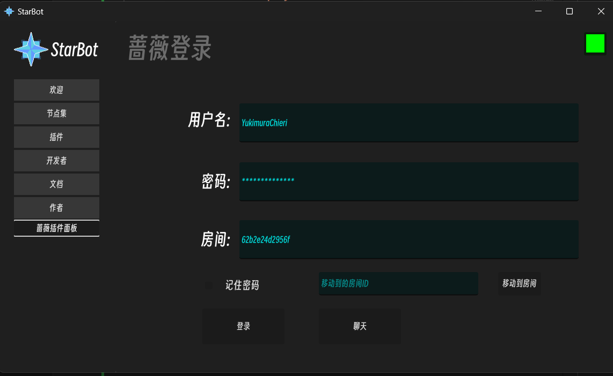
（目前UI还较为简陋，可能会在将来版本更改） 
登录操作后右上角变为绿色则为登录成功  
这时回到节点集界面,点击节点集条目的三角号进行运行。这时回到蔷薇进行测试，便可以看到自动回复了。
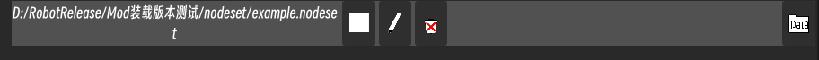
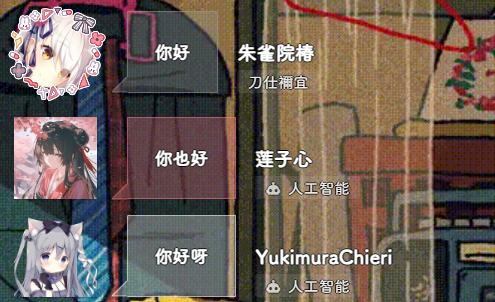 
恭喜你完成了这个示例项目！
