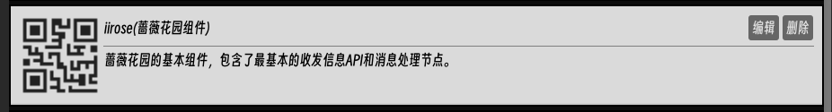

# 开始编写您的第一个机器人

在本文档中，您将学会如何使用Starbot编写您的第一个聊天机器人（以IIROSE蔷薇花园为例）

## 获取应用程序

可以从GitHub仓库获取本项目的源代码或分发的可执行文件

[Github仓库](https://github.com/TsubakiLoL/Godot-Robot)

本项目基于Godot 4.4版本开发

[Godot官网](https://godotengine.org/)

## 获取插件

 

 打开插件侧边栏可以查看当前已经装载的插件

 请确认已经装载了如下插件(默认分发携带基础插件)

- 基础插件

- 计算节点插件

- 蔷薇花园API插件


```tips
如果没有对应的插件可以尝试去侧边栏插件市场去搜索下载
```
## 开始编写可视化逻辑

拥有了以上插件依赖后，我们就可以为蔷薇花园编写一个基础的问答机器人逻辑了

```tips
Starbot的可视化逻辑被保存成了一个文本文件，我们称之为“节点集”，文件的后缀名一般为.nodeset
```

打开侧边栏中的节点集栏，我们可以点击创建节点集来进行新的节点逻辑的创建，创建完毕后，我们应该可以看到如下的条目


点击其中的笔图标我们就可以对这个节点集逻辑进行编辑了，正常情况下你应该可以看到如下界面：


这是我们的可视化编辑器,其中的可浮动窗口我们称之为节点，这也是为什么可视化逻辑集合被称为节点集的原因。


<div style="
  background:rgb(71, 75, 79);
  padding: 12px;
  border-radius: 6px;
  font-family: monospace;
  border: 1px solid #e1e4e8;
">
  <strong style="color:rgb(255, 255, 255)">什么是节点？</strong><br>
  <span style="color:rgb(150, 150, 150)">节点是可视化逻辑的基本构成单元，可以进行处理结果的传递。</span><br>
  <span style="color:rgb(150, 150, 150)">每个节点可视化UI左侧的端口名为输入端口，右侧的为输出端口，当左侧端口的所有端口都得到输入数据时，节点内部就会处理这些输入，然后把结果传递到输出端口中，并通过输出端口传递到与之相连的下游节点的输入端口中</span>
</div>

